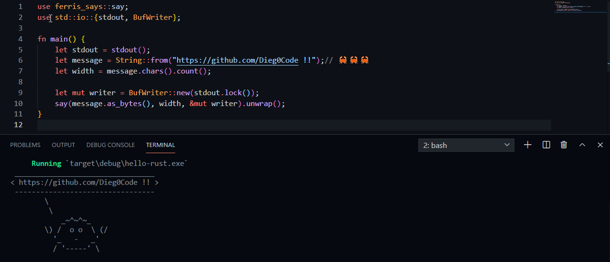

# Rust

En estas notas esta todo lo básico sobre el lenguaje `Rust`, con ejemplos de código y su respectiva explicación.

puedes encontrar la documentación oficial de Rust [aquí](https://www.rust-lang.org/learn/get-started)

🦀🦀🦀

🦀🦀🦀

Rust aplicado en proyectos:

- [snake game](https://github.com/Dieg0Code/SnakeGame)
- [CLI Port Sniffer](https://github.com/Dieg0Code/Port_Sniffer_CLI)
- [CLI Blockchain](https://github.com/Dieg0Code/Rust_Blockchain)
- [HTTP Server](https://github.com/Dieg0Code/HTTPServer.rs)
- [Blockchain.rs](https://github.com/Dieg0Code/Blockchain.rs)
