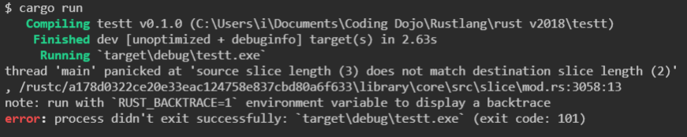
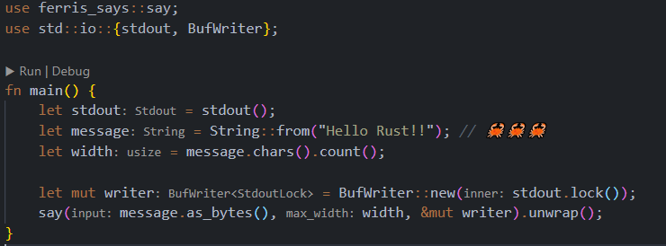

# Rust

`Rust` es un lenguaje de programación compilado multiparadigma, de alto nivel, de propósito general diseñado para eficiencia y seguridad, especialmente en cuanto a concurrencia. `Rust` es sintácticamente similar a `C++` pero puede garantizar seguridad en la memoria mediante el uso de un *borrow checker* para validar las referencias. `Rust` logra seguridad en la memoria sin un *garbage colector*.

Este lenguaje es de [código abierto](https://github.com/rust-lang) y fue creado inicialmente por **Graydon Hoare** en **Mozilla**.

Puedes encontrar más información sobre el lenguaje en [**Rust's website**](https://www.rust-lang.org/).

Este lenguaje es muy similar a `C++`, se podría decir que apunta a lo mismo, con la diferencia de que `Rust` es mucho mas moderno, no solo en su sintaxis y forma de manejar la concurrencia, sino también en su manejo de memoria, en el manejo de errores, viene con herramientas para testing de base, tiene un gestor de paquetes integrado llamado `cargo` al mas puro estilo **npm** y muchas otras cosas que permiten programar al mismo nivel que podemos llegar con `C++` pero con mucha mas fluidez y con muchos menos errores.

Para instalar `Rust` en tu equipo recomiendo ir directamente a la página oficial de [Rust](https://www.rust-lang.org/tools/install) y seguir las instrucciones.

Ahora, para ir más rápido:

Sistemas basados en `Linux`:

```bash
curl --proto '=https' --tlsv1.2 -sSf https://sh.rustup.rs | sh
```

Para windows debes ir por fuerza a la página oficial y descargar el archivo `rustup-init.exe` (32 o 64) y ejecutarlo.

La instalación de `Rust` trae 3 paquetes principales:

- `Cargo`: Es el gestor de paquetes de Rust, si ya has trabajado con `npm`, es casi lo mismo.
- `Rustup`: Es el gestor de versiones de Rust. Rust tiene una peculiaridad en cuanto a sus versiones, este cuenta con 3 versiones principales, `stable`, `beta` y `nightly`, siendo la version `stable` la mas usada, la version `nightly` trae nuevas funcionalidades y mejoras pero podría ser inestable, aunque aun asi es usada por algunos frameworks y librerias como en el caso de [Rocket](https://rocket.rs/) por ejemplo.
- `rustc`: Es el compilador de Rust, es el que se encarga de compilar el código de Rust.

- `Cargo` el gestor de paquetes cuenta con una página web [crates.io](https://cargo.io/) donde puedes encontrar todos los paquetes que hay disponibles.

- Otra página util es [what Rust is it?](https://www.whatrustisit.com/) en donde encontraras información sobre las versiones actuales de cada rama del lenguaje.

Otra característica muy interesante de `Rust` es que trae su documentación integrada para que podamos consultarla de manera offline. Para ello debemos usar el siguiente comando:

```bash
rustup doc
```

Lo que hace este comando es abrir una nueva pestaña en tu navegador web predeterminado con la documentación de Rust, esta trae varios libros los cuales podemos consultar.

La documentación trae `"The Book"` el cual es una guía completa del lenguaje y en mi opinión es la mejor forma de comenzar a aprenderlo.

Con este comando podemos abrir directamente el libro de Rust.

```bash
rustup doc --book
```

Otro comando importante es:

```bash
rustup doc --cargo
```

Este comando nos abre el `libro de Cargo`.

Para ver mas comandos que tiene que ver con documentación puedes usar:

```bash
rustup doc --help
```

*nota:* `rustup doc` no funcionaria en [`WSL`](https://docs.microsoft.com/en-us/windows/wsl/install-win10), ya que se necesita un navegador web para abrir la página.

## ¿Que hace a Rust tan seguro?

`Rust` busca frenar varias vulnerabilidades desde el momento en el que empiezas a escribir código, simplemente no compilará si hay algún error de sintaxis o algún bug relacionado con un mal manejo de la memoria, tiene un *borrow checker* el cual se encarga de validar las referencias de memoria, si no se encuentra una referencia de memoria que se esta usando, `Rust` arrojará un error.

Protege la memoria por diseño, se asegura de que el programador use los recursos correctamente y no se dejen referencias de memoria sin usar(sin importar bajo que condiciones se ejecute el programa). Con esto se evitan el [**70% de los bugs de seguridad**](https://www.ordenadores-y-portatiles.com/bug/) que se pueden producir en programación.

Rust advertirá y prevendrá:

- [Buffer overflow](https://www.welivesecurity.com/la-es/2014/11/05/como-funcionan-buffer-overflow/).
- [Use after free](https://vulncat.fortify.com/es/detail?id=desc.controlflow.cpp.use_after_free).
- [Double-free](https://vulncat.fortify.com/es/detail?id=desc.controlflow.cpp.double_free).
- [Null pointer dereference](https://stackoverflow.com/questions/4007268/what-exactly-is-meant-by-de-referencing-a-null-pointer).
- [Using uninitialized memory](https://pvs-studio.com/en/blog/terms/0079/#:~:text=Use%20of%20uninitialized%20memory%20means,a%20so%20called%20%22heisenbug%22.).

Si comparamos un trozo de código `Rust` con uno `C++`, se vuelve evidente que `Rust` es seguro por diseño:

```c++
#include <iostream>
#include <string.h>
int main(void) {
    char a[3] = "12";
    char b[4] = "123";
    strcpy(a, b); // Buffer overflow porque 'a' no tiene memoria suficiente para copiar 'b' en ella. std::cout << a << "; " << b << std::endl;
}
```

Vs.

```rust
pub fn main() {
    let mut a:[char; 2] = ['1', '2'];
    let b:[char; 3] = ['1', '2', '3'];
    a.copy_from_slice(&b); // Buffer overflow porque 'a' no tiene memoria suficiente para copiar 'b' en ella. println!("{}; {}", a, b);
}
```



`Rust` nos devuelve un error, y detiene la ejecución del programa al llegar a la función `copy_from_slice`, esto lo detecta `Rust` al chequear el tiempo de ejecución, no en la compilación.

`Rust` le enseña al programador la forma correcta de como deberíamos escribirlo si queremos evitar bugs de seguridad relacionados con el uso de la memoria.

A medida que se va trabajando con el lenguaje podemos darnos cuenta de que `Rust` de cierta manera se enseña a si mismo. Ya sea con la documentación que trae por default o con el mismo compilador el cual no solo nos indica los errores de sintaxis, sino que también nos da tips sobre como solucionar dichos errores, los logs que devuelve son muy claros y nos ayudan a entender que hacemos mal.

### Razones para usar Rust

- `Seguridad de tipos`: El compilador nos asegura que ninguna operación será aplicada a una variable del tipo incorrecto.
- `Seguridad de memoria`: Todas las referencias siempre apuntarán a una dirección de memoria válida.
- `Sin condiciones de carrera`: El sistema de *ownership* nos garantiza que múltiples partes del programa no puedan modificar el mismo valor al mismo tiempo.
- `Abstracciones a costo cero`: Rust nos permite usar conceptos de alto nivel (iteraciones, interfaces, enums, programación funcional, etc) con un costo nulo o mínimo en rendimiento.
- `Runtime mínimo`: Rust tiene un runtime mínimo y lo más optimizado posible, similar a `C` y `C++`.
- `Usado en Webassembly`: [WebAssembly](https://rustwasm.github.io/), abreviado wasm, es un formato de código binario portable, para la ejecución íntegra en navegador de scripts de lado del cliente. Se trata de un lenguaje de bajo nivel, diseñado inicialmente como formato destino en la compilación desde C y C++, aunque se puede usar en otros lenguajes como `Rust` o Go. En pocas palabras permite ejecutar lenguajes de alto rendimiento en el navegador de forma nativa.
- [`Gran potencial para el desarrollo de videojuegos`](https://arewegameyet.rs/): Cuando buscamos opciones que potencien el rendimiento de un videojuego, Rust es una opción mas que viable.
- `Desarrollo web`: A pesar de ser un lenguaje relativamente nuevo ya posee [formas](https://www.arewewebyet.org/) de usarse en el desarrollo web, tanto para el backend como para el frontend (usando wasm 😮).

## ¿Que es Cargo?

`Cargo` es el package manager (gestor de paquetes) de Rust, como `npm`, `yarn` en JS o `pip` en Python. Este package manager nos ayuda a compilar el código, descargar dependencias, compilar dependencias, etc.

Para checar la version de Cargo que tenemos instalada:

```bash
cargo --version
```

Una de las utilidades de `cargo` es que nos ayuda a armar la estructura de nuestro proyecto para que no tengamos que crearla a mano.

Para crear un nuevo proyecto usando `cargo`:

```bash
cargo new nombre-del-proyecto
```

Este comando nos crea una carpeta con el nombre del proyecto, dentro un archivo `Cargo.toml` y una carpeta `src` con un archivo `main.rs` que contiene el código principal.

### El archivo `Cargo.toml`

Este es el archivo que indica la configuración del proyecto. Indica las dependencias que necesita, las versiones de las mismas, el nombre del proyecto, la versión del proyecto, etc.

Ej:

```toml
[package]
name = "nombre-del-proyecto"
version = "0.1.0"
authors = ["Mi nombre"]
edition = "2018"

[dependencies]
```

No tenemos que reinventar la rueda cada vez que comenzamos un nuevo proyecto, podemos usar paquetes que han echos otros desarrolladores para incluir diferentes funcionalidades en la aplicación.

En Rust los paquetes de dependencias se llaman `crates` (en español seria como cajón, de esos que suelen estar en los puertos).

En vez de ir compilando los archivos manualmente, podemos usar `cargo` para hacerlo automáticamente.

```bash
cargo build
```

Este comando compila todo el proyecto y deja el binario resultante en la carpeta `target`.

Existe otro comando que compila y luego ejecuta el binario:

```bash
cargo run
```

Otro comando muy util es:

```bash
cargo check
```

El cual comprueba si el código es correcto para ser compilado, pero no lo compila. Es mucho más rápido que usar `cargo build` o `cargo run`.

Existe una variación del comando `cargo build`:

```bash
cargo build --release
```

Este comando compila el proyecto en modo `release`, aplicando optimizaciones para que el binario sea más eficiente. Este comando es muy útil cuando trabajamos con el proyecto en producción, pero no es necesario para el desarrollo ya que hace que la compilación sea más lenta.

Cuando usamos `--release` se crea otra carpeta dentro de `target` llamada `release` que contiene el binario compilado con las optimizaciones.

## ¿Que IDE usar?

En la sección [tools](https://www.rust-lang.org/tools) de la página web de Rust encontramos una lista de herramientas que nos ayudan a programar con el lenguaje. Para esto tenemos que instalar las herramientas correspondientes, en mi caso el que yo uso y recomiendo es [Vscode](https://code.visualstudio.com/), con el plugin [Rust analyzer](https://marketplace.visualstudio.com/items?itemName=matklad.rust-analyzer), recomiendo ese plugin por sobre otros ya que este nos provee *inlay hints*, estos son marcadores especiales que aparecen en el editor, los cuales nos muestran información adicional sobre el código que estamos escribiendo.



En este caso nos da información sobre el tipo de dato de las variables, nos da información adicional sobre los parámetros en las funciones, etc. Muy útil.

### Para debugear

Para sistemas mac/linux y windows (x86 only):

- [CodeLLDB](https://marketplace.visualstudio.com/items?itemName=vadimcn.vscode-lldb)

Para windows:

- [C/C++ extension](https://marketplace.visualstudio.com/items?itemName=ms-vscode.cpptools)

Las extensiones de debuger son muy útiles, ya que mediante *breakpoints* podemos detener la ejecución del código en lineas específicas, y así ver el estado de la ejecución hasta ese punto.

### Otras extensiones útiles

- [TOML Language Support](https://marketplace.visualstudio.com/items?itemName=be5invis.toml) (soporte para archivos TOML)

- [crates](https://marketplace.visualstudio.com/items?itemName=serayuzgur.crates) (soporte para dependencias de Rust)

## Antes de empezar

Es importante que también conozcamos un par de herramientas más que nos provee `Rust` para las buenas prácticas de programación.

### Rustfmt

[`Rustfmt`](https://github.com/rust-lang/rustfmt) formatea automáticamente el código, haciéndolo más fácil de leer, escribir y mantener. Y lo más importante: nunca más tendremos que debatir si es mejor usar espacios o tabulaciones.

Una vez instalado. Para usarlo debemos ejecutar el siguiente comando en la carpeta del proyecto:

```bash
cargo fmt
```

### Clippy

[`Clippy`](https://github.com/rust-lang/rust-clippy) ayuda a los desarrolladores de todos los niveles de experiencia a escribir código más limpio, mas idiomático, y a reforzar los estándares.

Una vez instalado. Para usarlo debemos ejecutar el siguiente comando en la carpeta del proyecto:

```bash
cargo clippy
```

Y nos dará una lista de sugerencias de código que podemos aplicar para mejorar la calidad y legibilidad de este.

### Cargo Doc

`cargo doc` nos permite generar una documentación de nuestro proyecto de forma automática.

Podemos usarlo localmente y ver lo que genera con el siguiente comando:

```bash
cargo doc --open
```

También está de forma [online](https://docs.rs/) con la documentación de todos los *crates* públicos.

## Variables, inmutabilidad y constantes

Para declarar una variable en Rust, debemos usar la palabra `let` y el nombre de la variable.

```rust
let x = 5;
```

Para ver en la consola el valor de esta variable hacemos lo siguiente:

```rust
println!("El valor de x es: {}", x);
```

En este caso, el valor de la variable `x` es 5. Los símbolos `{}` indican que en esa posición se va a insertar el valor de una variable la cual debe pasarse luego.

Podemos imprimir más de una variable con `{}`:

```rust
println!("El valor de x es: {}, y el valor de y es: {}", x, y);
```

Tendríamos que declarar las variables `x` e `y` antes de usarlas.

Como te habrás dado cuenta Rust finaliza la declaración de las lineas con `;` al igual que en otros lenguajes, como `Java` por ejemplo.

Un código "real" se vería mas o menos así:

```rust
fn main() {
    let x = 5;
    let y = 10;
    println!("El valor de x es: {}, y el valor de y es: {}", x, y);
}
```

La función `main` es la función principal del programa, y es la que se ejecuta primero.

Rust es en realidad un lenguaje fuertemente tipado, es decir que todas las variables deben tener un tipo de dato, sin embargo, si no lo hacemos, si no declaramos el tipo, Rust es lo suficientemente inteligente para inferir el tipo de dato de la variable.

*Aquí es donde son útiles los inlay hints.*

```rust
fn main() {
    let x: u8 = 5;
    // Si tratamos de usar otro tipo de dato en la variable `x` nos dará un error.
    println!("El valor de x es: {}", x);

    // También podemos definir una variable y después asignarle un valor.
    let y: u8;
    y = 10;
    println!("El valor de y es: {}", y);
}
```

### Inmutabilidad

Por defecto en Rust las variables son inmutables, esta es una de las características del lenguaje que nos ayudan a programar de una manera más segura, en el sentido de minimizar los bugs y errores.

Ejemplo:

```rust
// Si declaro una variables con let, esta variable no puede ser modificada.
let x = 5;
x = 6; // Error can't assign twice to inmutable variable
```

Si queremos que las variables sean mutables, debemos usar la palabra `mut` antes de la variable.

```rust
fn main() {
    let mut x = 5;
    println!("El valor de x es: {}", x);
    x = 6; // en este caso no hay error
    println!("El valor de x es: {}", x);
}
```

En Rust también tenemos algo llamado `shadowing` que es cuando creamos otra variable con el mismo nombre que una variable ya existente.

```rust
fn main() {
    let x = 5;
    println!("El valor de x es: {}", x);
    let x = 6; // en este caso no hay error
    println!("El valor de x es: {}", x);
}
```

Al ser las variables inmutables, sabemos que su valor no va cambiar a menos que la veamos declarada nuevamente, en eso consiste el concepto de `shadowing`.

Otro uso del `shadowing`:

```rust
fn main() {
    let x = 10;
    println!("El valor de x es: {}", x); // 10
    let x = x + 5; 
    println!("El valor de x es: {}", x); // 15

    // otro uso interesante del shadowing es cambiar el tipo de dato de una variable
    let espacios = "   ";
    println!("El usuario ingresó: {}", espacios); // "   "
    let espacios = espacios.len();
    println!("El número de espacios es: {}", espacios); // 3
```

### Constantes

Las constantes se definen con la palabra reservada `const` y son declaradas en mayúsculas separadas por un guión bajo. A diferencia de las variables `let`, debemos proveer obligadamente el tipo de dato, tampoco se le puede hacer `shadowing` a las constantes. Otra característica es que pueden ser declaradas de forma global o local.

```rust
// las constantes no pueden ser modificadas
const MAX_POINTS: u32 = 100_000; // se puede usar _ para separar los números y hacerlo más legible
fn main() {
    println!("El valor máximo de puntos es: {}", MAX_POINTS); // 100_000
}
```

## Tipos de datos

Rust es un lenguaje con tipado estático, es decir que el chequeo de los tipos de dato se hace al compilar el código, no al ejecutarlo. A diferencia de otros lenguajes como Python o Javascript, los cuales son de tipado dinámico y se chequean al ejecutar el código.


### Tipos de dato `Integer`

| Longitud | Con signo | Sin signo |
|----------|----------|-----------|
| 8-bit     | `i8`     | `u8`      |
| 16-bit    | `i16`    | `u16`     |
| 32-bit    | `i32`    | `u32`     |
| 64-bit    | `i64`    | `u64`     |
| 128-bit   | `i128`   | `u128`    |
| arch     | `isize`  | `usize`   |

*La "u" en `u8` por ejemplo significa unsigned, es decir, que no tiene signo, es decir, no puede ser negativo, mientras que `i8` es signed, es decir, puede ser negativo.*

Ej:

```rust
let x: u8 = 5;
let y: i8 = -5;
```

*Los tipos `isize` y `usize` dependen del sistema operativo en el que estemos ejecutando el programa. La longitud seria 64 bits en un sistema operativo de 64 bits, 32 bits en un sistema operativo de 32 bits.*

También podemos declarar enteros de cualquiera de las siguientes formas:

| Números literales | Ejemplo |
|-------------------|---------|
| Decimal     | `98_222` |
| Hex       | `0xff`   |
| Octal     | `0o77`   |
| Binario   | `0b1111_0000` |
| Byte (`u8` only)      | `b'A'`   |

Si no sabemos que tipo de dato usar para los enteros Rust por defecto asignará un `i32`.

### Tipo `Float`

Los tipos `Float` son aquellos que contienen un punto decimal, en Rust están `f32` y `f64`, los cuales son de 32 y 64 bits respectivamente.

El tipo por defecto para los floats es `f64`.

Ej:

```rust
let x = 2.0; // f64
let y: f32 = 3.0; // f32
```

### Tipo `Boolean`

Solo dos valores posibles: `true` y `false`.

```rust
let x = true;
let y = false;
let z: bool = false;
```

### Tipo `Char`

Reservado para caracteres unicode.

```rust
// se declaran con comillas simples
let caracter = 'a';
let emoji = '😀';
// tambien caracteres chinos, koreanos, japoneses, etc.
let chino = '山';
let korean = '한';
let japones = '日';
```

Todos los tipos de datos anteriores son llamados "tipos escalares".

### Tipos compuestos

### Tuplas

Las tuplas son una forma de agrupar valores de diferentes tipos en una sola variable.

```rust
let tupla = (1, "Hola", true); // tupla de 3 elementos
// también puedo decir explícitamente el tipo de dato de cada elemento
let tupla1: (char, u32, bool) = ('a', 5, true);
```

También podemos usar una tupla de la siguiente forma:

```rust
let tupla: (char, u32, bool) = ('a', 5, true);
let (primero, segundo, tercero) = tupla;
// de esta forma asignamos cada uno de los elementos de la tupla a una variable respectivamente.
```

También podemos acceder a los valores de la tupla usando el índice:

```rust
// como de costumbre, los índices empiezan en 0
let tupla = (1, "Hola", true);
let primero = tupla.0; // 1
let segundo = tupla.1; // "Hola"
let tercero = tupla.2; // true
```

Las tuplas tienen un tamaño fijo, es decir, no pueden cambiarse de tamaño después de la declaración.

### Arreglos / array

Los arrays también son de tamaño fijo, si queremos una lista que se expanda dinámicamente debemos usar un vector.

```rust
// array
let arreglo = [1, 2, 3, 4, 5]; // recuerda que los índices empiezan en 0
println!("El valor de la posición 2 es: {}", arreglo[2]); // 3
```

En un `array` todos los elementos tienen el mismo tipo de dato a diferencia de las tuplas.

Podemos definir con mas detalle el tipo de dato de cada elemento de un array y su tamaño:

```rust
// array de 4 elementos de tipo `i32`
let arreglo: [i32; 4] = [1, 2, 3, 4];
```

### Tipo `string`

En Rust existen dos tipos de strings:

```rust
// string slice
let nombre: &'static str = "Juan"; // &'static str es un tipo de dato que indica que el string no va a cambiar de tamaño y que es estático.

// String
let nombre1: String = "Juan".to_string(); // String es un tipo de dato que permite cambiar de tamaño la cadena a diferencia de &'static str que mantiene el mismo tamaño una vez declarada.
```

El tipo `String` es en el fondo un vector de valores `u8`, este tipo permite que la longitud del string sea variable y se almacena en el [heap](https://codingornot.com/diferencias-entre-heap-y-stack) .

Podemos inicializar una variable de tipo `String` de la siguiente forma:

```rust
let mut apellido: String = String::new();
apellido = "Pérez".to_string();
```

## Funciones

Las funciones son bloques de código que se ejecutan cuando son nombradas. En Rust se declaran con la palabra reservada `fn`.

```rust
// se escriben en formato snake_case
fn suma_dos_numeros(a: i32, b: i32) -> i32 {
    a + b // return es opcional
}

fn mostrar_bienvenida() {
    println!("Bienvenido a Rust!");
}

fn main() {
    let a = 1;
    let b = 2;
    let resultado = suma_dos_numeros(a, b); // llamamos a la función, le pasamos los parámetros y asignamos el resultado a una variable
    mostrar_bienvenida(); // llamada a la función
    println!("El resultado de la suma es: {}", resultado);
}
```

Las funciones pueden recibir parámetros entre los paréntesis y devolver valores. El valor de retorno se define con `->` y se puede omitir si la función no devuelve ningún valor.

Para indicar que es lo que devuelve una función, se usa la palabra reservada `return`, aunque esto es opcional en Rust, este siempre devolverá la última expresión de la función, esto no funciona si ponemos un `;` en la expresión que se devuelve.

```rust
fn calcular_area(base: f32, altura: f32) -> f32 {
    base * altura // no se pone `;`
}
```

También podemos hacer otras cosas interesantes con las funciones:

```rust
fn main() {
    let numero = { // guiño a la programación funcional
        10
    };
    println!("El número es: {}", numero);
    // saludar_con_nombre("Juan".to_string());
    saludar_con_nombre("Juan");
}

// pasar una string como parámetro
/*
fn saludar_con_nombre(nombre: String) {
    println!("Hola {}", nombre);
}
*/
// podemos usar el tipo de dato `&str` para pasar el parámetro como una referencia
// así nos evitamos hacer .to_string() luego de pasar el parámetro
fn saludar_con_nombre(nombre: &str) {
    println!("Hola {}", nombre);
}
```

El operador `&` nos permite hacer referencia a la ubicación en memoria de un valor.

## Structs

Los structs son tipos de datos compuestos, es decir, que contienen más datos dentro de ellos, esto se define con la palabra reservada `struct`.

Quizás te recuerden a las `clases` en Java.

```rust
// guiño a la programación orientada a objetos
struct Persona {
    nombre: String,
    email: String,
    edad: u32,
    sexo: char,
    esta_vacunado: bool,
}

fn main() {
    // esto es una instancia de la struct, muy parecido a un objeto en Java
    let persona = Persona {
        nombre: "Juan".to_string(),
        email: String::from("email@email.com"),
        edad: 20,
        sexo: 'M',
        esta_vacunado: true,
    };
    println!("{}", persona.nombre); // Juan
    println!("{}", persona.email); // email@email.com
    println!("{}", persona.edad); // 20
    println!("{}", persona.sexo); // M

    // persona.esta_vacunado = false; // no se puede modificar esta propiedad porque la instancia no es mutable

    // podemos crear una instancia mutable con `mut`
    let mut persona_nueva = {
        nombre: "Pedro".to_string(),
        email: String::from("abc@email.com"),
        edad: 30,
        sexo: 'M',
        esta_vacunado: false,
    };

    persona_nueva.nombre = "Pepe".to_string(); // la instancia persona_nueva es mutable, por lo que podemos modificar sus propiedades.
}
```

Otra propiedad importante de los structs es lo que se conoce como `shorthand init`, esto es cuando una `propiedad` de una `struct` tiene el mismo nombre que el `parámetro` de una `función`, en ese caso Rust asigna automáticamente el valor del parámetro a la propiedad del struct.

```rust
struct Persona {
    nombre: String,
    email: String,
    edad: u32,
    sexo: char,
    esta_vacunado: bool,
}
fn main() {
    let user1 = nueva_persona(String::from("Andres"), "abc@email.com");

    // otra propiedad interesante:
    let user2 = Persona {
        nombre: "Juan".to_string(),
        email: "otroemail@email.com".to_string(),
        ..user1 // el operador .. hace que se copien todas las demás propiedades de user1 a user2
        // por lo que se copiarían todos los valores que no son `nombre` e `email`
    };
}

fn nueva_persona(nombre: String, email: String) -> Persona {
    Persona {
        nombre, // shorthand init en vez de poner nombre: nombre
        email,
        edad: 20,
        sexo: 'M',
        esta_vacunado: true,
    }
}
```

También existen las `tuple structs`:

```rust
struct Point(i32, i32, i32);

let pointA = Point(1, 2, 3);
```

Son útiles para el chequeo de tipos y evitar errores al instanciar un struct.

También podemos implementar métodos en los `structs` con la palabra reservada `impl`.

Lo que hacen estos métodos que implementamos en los `structs` es añadir funcionalidades asociadas a estos, de forma que luego podemos escribir algo similar a *struct.method()* para invocar la funcionalidad.

```rust
struct Persona {
    nombre: String,
    email: String,
    nacimiento: i32,
    sexo: char,
    esta_vacunado: bool,
}
impl Persona { // impl es el equivalente a un método de una clase en Java
    fn edad(&self) -> i32 { // self es una referencia a la instancia del struct
    // las implementaciones siempre reciben un self
        let ahora = 2021;
        ahora - self.nacimiento
    }
}

fn main() {
    let persona = Persona {
        nombre: "Juan".to_string(),
        email: String::from("abc@email.com"),
        nacimiento: 2000,
        sexo: 'M',
        esta_vacunado: false,
    };

    let edad = persona.edad();
    println!("{}", edad); // 21
}
```